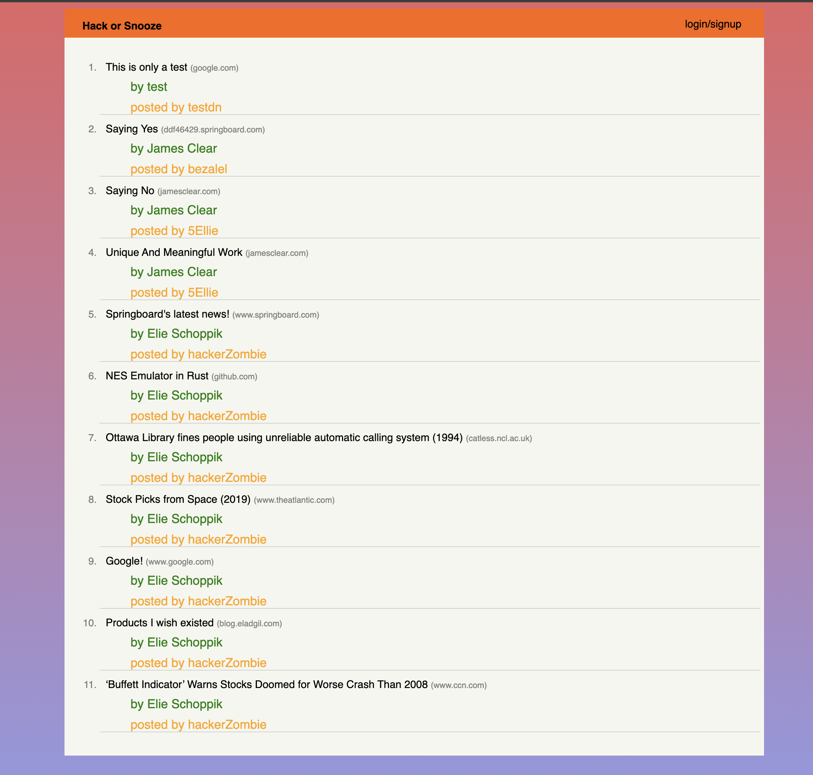
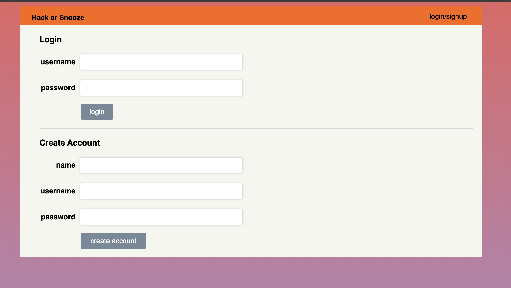
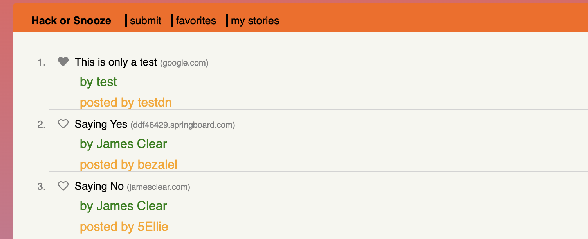
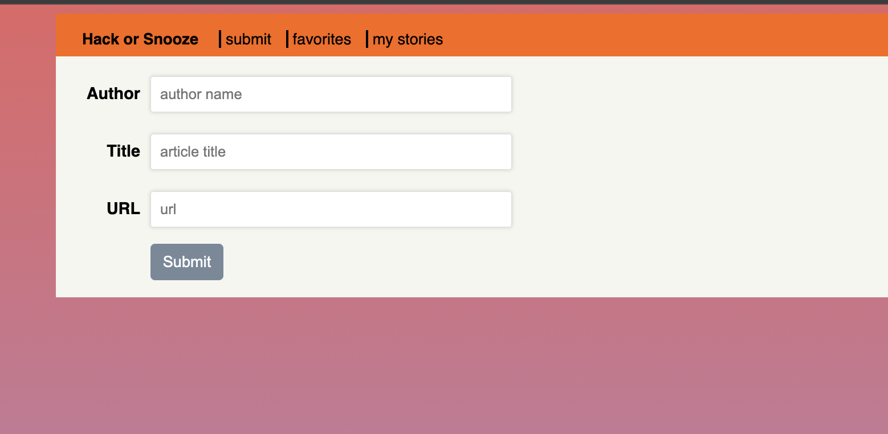
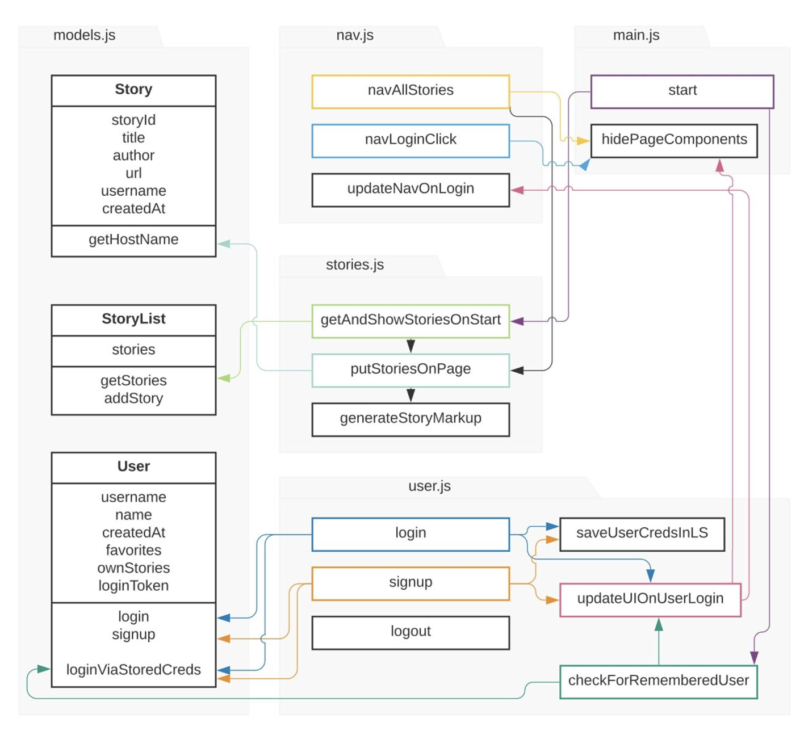

# bc17_HackOrSnooze
This is a solution to an AJAX with JQuery Practice Challenge 

## Table of contents

- [Overview](#overview)
  - [The challenge](#the-challenge)
  - [Screenshot](#screenshot)
  - [Links](#links)
- [My process](#my-process)
  - [Built with](#built-with)
  - [What I learned](#what-i-learned)
  - [Continued development](#continued-development)
  - [Useful resources](#useful-resources)
- [Author](#author)

## Overview

In this project, I built a functional clone of Hacker News based on the data available in their API. Your site will have the same stories that someone can read on Hacker News. Hacker News is a tech news aggregator founded by Paul Graham, the man behind Y Combinator. It is an online source for intellectually stimulating news, and its content is not just limited to software technology. The loosley cloned website will allow users to create accounts and log in, save their favorite articles, and upload stories of their own! 

### The challenge

Users should be able to:

- create accounts
- log in 
- create articles 
- mark articles as favorites which persits after logging out
- delete articles they submitted

### Screenshot

### Links

- Solution URL: N/A
- Live Site URL: N/A

## My process

### Built using
 
- Javacript
- JQuery
- AJAX w/ Axios

### What I learned

The main focus of this project was to interact with a custom API using AJAX. I am new to using Axios and get/post requests, so this was great practice. I am starting to feel more confident with creating GET and POST requests to return and update specific data.    

### Continued development

This was a challenging exercise to complete, and I would like to update aspects of this project in the future including:
- adding error handling for when a username has already been taken or credentials are incorrect
- allow users to edit their stories
- make the project more responsive to mobile devices
- Add an infinite scoll to the stories

### Useful resources

- [MDN](https://developer.mozilla.org/en-US/docs/Web/API/Document_Object_Model) - This helped me when using the Document Object Model to create this project. 
- [Axios API](https://axios-http.com/docs/api_intro) - The Axios API docs helped a lot to review syntax and look up functions. 
- [Hack or Snooze API](https://hackorsnoozev3.docs.apiary.io/#) - The Hack or Snooze API helped with endpoints
- [Udemy](https://www.udemy.com/course/the-web-developer-bootcamp) - This Udemy course has helped me to brush up on how to use the DOM. I'd recommend it to anyone still learning this concept.
- [Springboard](https://www.springboard.com/) - This is the Bootcamp where I am currently gaining a deeper understanding of JavaScript and many other full stack languages, workflows, and concepts.  

## Author

- Frontend Mentor - [@TechEdDan2](https://www.frontendmentor.io/profile/TechEdDan2)